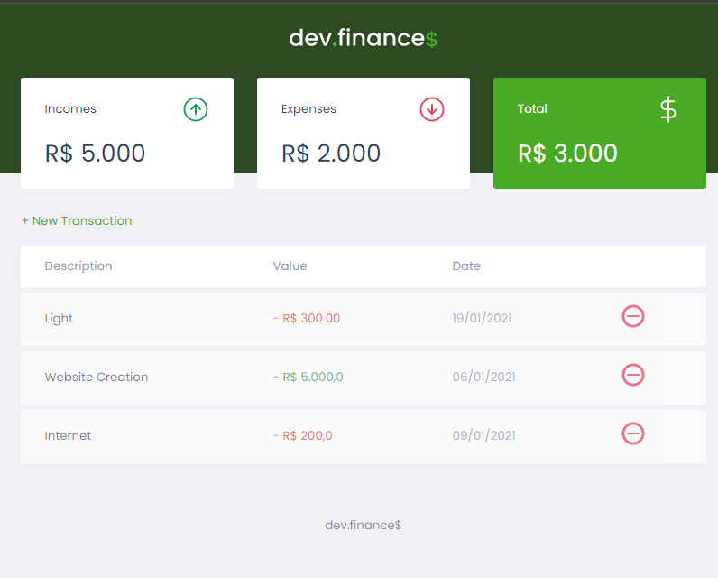
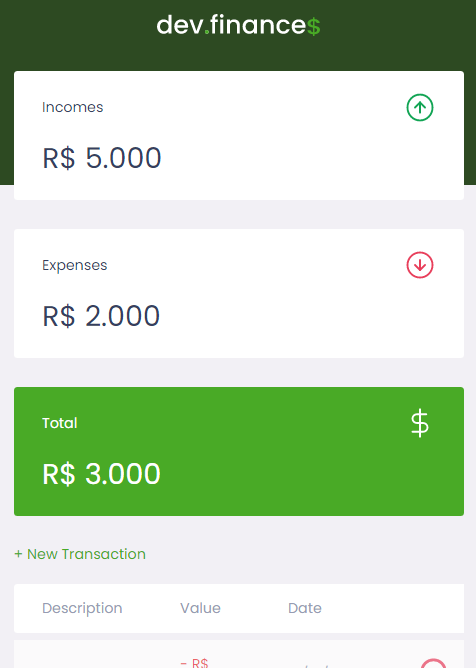
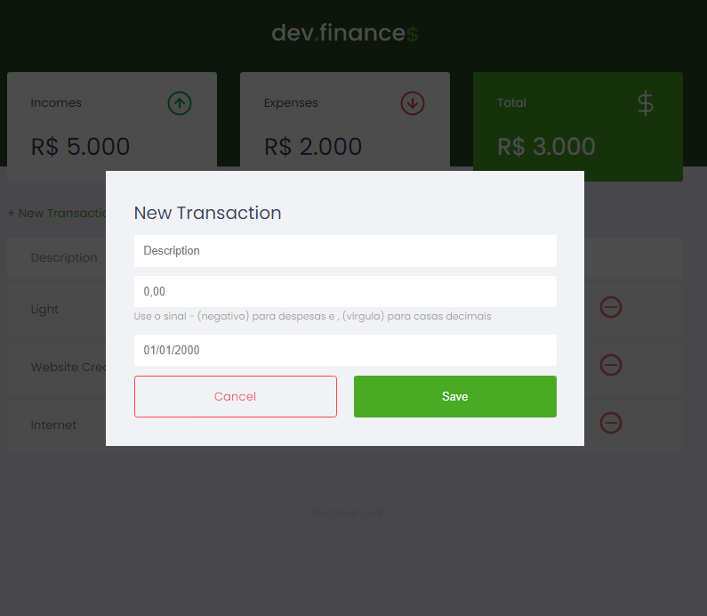

##  Description

This project is a small finance app create only with HTML, CSS and JavaScript. This layout is reponsive to adapt to small screens
it has a modal funcionality,and you can add expenses and incomes the you had during the month and it will automatically calculate
the difference beetween your incomes and expenses for you to control better your money.

<small>
This project was made during an online event called "Maratona Discover" from the RocketSeat Company. 
</small>

***
<div style="display:inline" >



</div>

***

## Setup

Go to your local reposity and clone this one, than open the folder in an text editor and execute the index.html file. 

```
git clone https://github.com/avnerjose/Mataona-Discover-HTML-CSS-JS-Layout-.git
```
